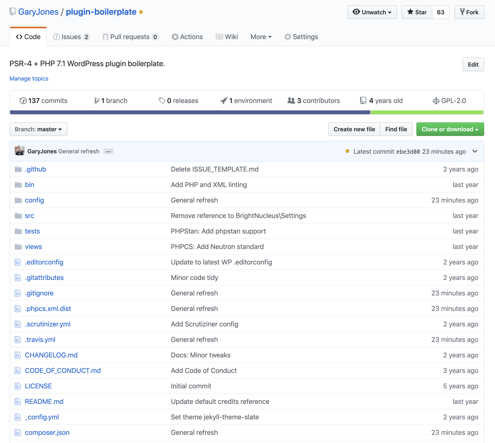

# Plugin Boilerplate

Stable tag: 0.1.0  
Requires at least: 6.6  
Tested up to: 6.6  
Requires PHP: 8.2  
License: GPLv2 or later  
License URI: https://www.gnu.org/licenses/gpl-2.0.html  
Tags:   
Contributors: garyj

Short summary about the plugin.

## Description 

Long description about the plugin.

## Screenshots

  
_Screenshot 1 caption HERE._

## Installation

### Upload

1. Download the latest tagged archive (choose the "zip" option).
* Go to the __Plugins__ → __Add New__ screen and click the __Upload__ tab.
* Upload the zipped archive directly.
* Go to the Plugins screen and click __Activate__.

### Manual

1. Download the latest tagged archive (choose the "zip" option).
* Unzip the archive.
* Copy the folder to your `/wp-content/plugins/` directory.
* Go to the Plugins screen and click __Activate__.

Check out the Codex for more information about [installing plugins manually](http://codex.wordpress.org/Managing_Plugins#Manual_Plugin_Installation).

### Git

In a terminal, browse to your `/wp-content/plugins/` directory and clone this repository:

~~~sh
git clone git@github.com:GaryJones/plugin-slug.git
~~~

Then go to your Plugins screen and click __Activate__.

### Composer

~~~sh
compose require gamajo/plugin-slug
~~~

## Updates

This plugin supports the [GitHub Updater](https://github.com/afragen/github-updater) plugin, so if you install that, this plugin becomes automatically updateable direct from GitHub.

## Change Log

Please see [CHANGELOG.md](CHANGELOG.md).

## Contributing

See the [contributing document](.github/CONTRIBUTING.md).

## Support

See the [support document](.github/SUPPORT.md).

## Licensing

The code in this project is licensed under [GPL v2 or later](LICENSE).

## Credits

Built by [Gary Jones](https://twitter.com/GaryJ)  
Copyright 2018 [Gary Jones](https://garyjones.io)
