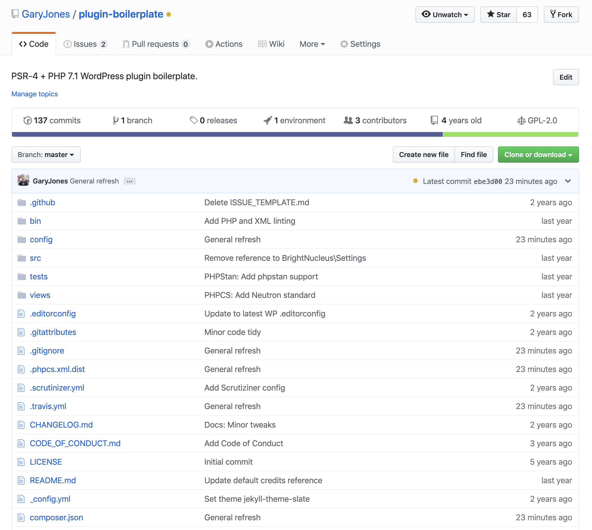

# Plugin Boilerplate

Stable tag: 0.1.0  
Requires at least: 6.9  
Tested up to: 7.0  
Requires PHP: 8.4  
License: GPLv2 or later  
License URI: https://www.gnu.org/licenses/gpl-2.0.html  
Tags: boilerplate  
Contributors: garyj

Short summary about the plugin.

## Description

Long description about the plugin.

## Screenshots

  
_Screenshot 1 caption HERE._

## Installation

### Upload

1. Download the latest tagged archive (choose the "zip" option).
2. Go to the __Plugins__ → __Add New__ screen and click the __Upload__ tab.
3. Upload the zipped archive directly.
4. Go to the Plugins screen and click __Activate__.

### Manual

1. Download the latest tagged archive (choose the "zip" option).
2. Unzip the archive.
3. Copy the folder to your `/wp-content/plugins/` directory.
4. Go to the Plugins screen and click __Activate__.

See the WordPress documentation for more information about [installing plugins manually](https://wordpress.org/documentation/article/manage-plugins/#manual-plugin-installation-1).

### Git

In a terminal, browse to your `/wp-content/plugins/` directory and clone this repository:

~~~sh
git clone git@github.com:GaryJones/plugin-slug.git
~~~

Then go to your Plugins screen and click __Activate__.

### Composer

~~~sh
composer require gamajo/plugin-slug
~~~

## Updates

This plugin supports the [Git Updater](https://github.com/afragen/git-updater) plugin (formerly known as GitHub Updater), so if you install that, this plugin becomes automatically updateable direct from GitHub.

## Development

### Prerequisites

- PHP 8.4 or later
- [Composer](https://getcomposer.org/)
- [Node.js](https://nodejs.org/) (LTS)
- [Docker](https://www.docker.com/), used by [wp-env](https://developer.wordpress.org/block-editor/reference-guides/packages/packages-env/) for the local development and integration test environment

### Setup

~~~sh
composer install
npx @wordpress/env start
~~~

### Composer scripts

| Script | Description |
|--------|-------------|
| `composer lint` | Lint PHP and XML files for syntax errors. |
| `composer cs` | Check coding standards with PHPCS. |
| `composer cs-fix` | Fix coding standards violations with PHPCBF. |
| `composer test:unit` | Run the unit tests. |
| `composer test:integration` | Run the integration tests inside wp-env. |
| `composer test:integration-ms` | Run the integration tests against Multisite. |
| `composer coverage` | Run the unit tests with a code coverage report. |
| `composer infection` | Run mutation tests with Infection. |
| `composer rector` | Check for automated refactoring opportunities with Rector. |
| `composer phpstan` | Run static analysis with PHPStan. |

## FAQ

### How do I use this boilerplate?

Search the codebase for `plugin-slug`, `plugin_slug`, `PLUGIN_SLUG`, `PluginSlug` and `Plugin Boilerplate`, and replace each with the equivalent names for your plugin.

### Why is PHPUnit pinned to 9.6?

The integration tests extend `WP_UnitTestCase`, and the WordPress core test framework does not yet support anything newer than PHPUnit 9.6.

### Why is composer.lock not committed?

This is a boilerplate, so consumers should resolve dependencies against their own constraints and commit their own lock file.

## Change Log

Please see [CHANGELOG.md](CHANGELOG.md).

## Contributing

See the [contributing document](.github/CONTRIBUTING.md).

## Support

See the [support document](.github/SUPPORT.md).

## Licensing

The code in this project is licensed under [GPL v2 or later](LICENSE).

## Credits

Built by [Gary Jones](https://github.com/GaryJones)  
Copyright 2024-2026 [Gary Jones](https://garyjones.io)
